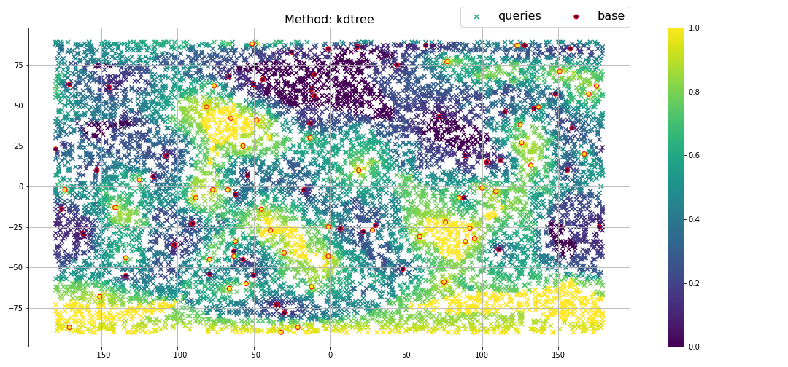
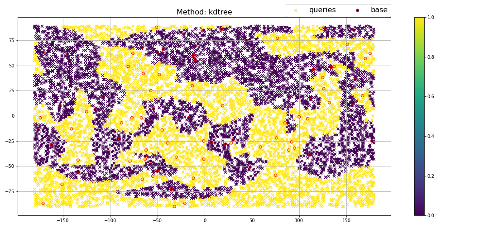
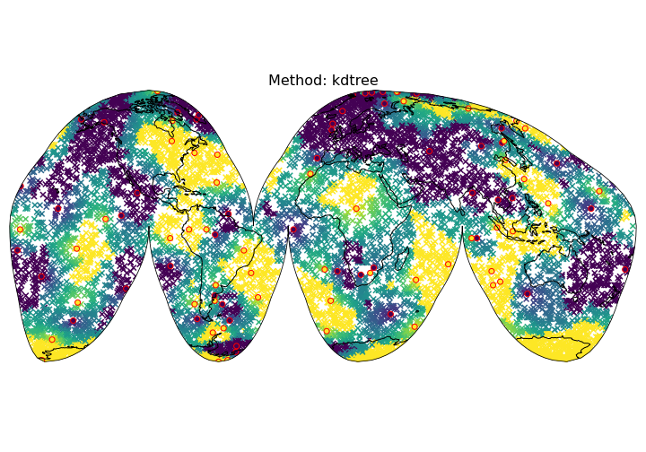
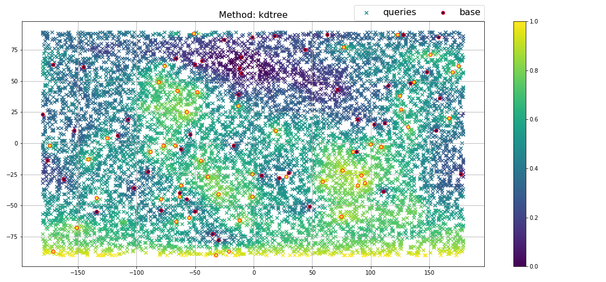
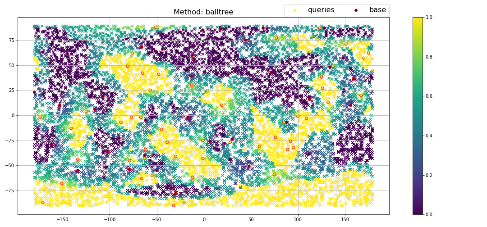

<div align="center">
    <br>
    <h2>GeoTree: nearest-neighbors on geographic coordinates</h2>
</div>

<p align="center">
    <a href="https://github.com/kasra-hosseini/geotree/blob/main/LICENSE">
        
    </a>
    <br/>
</p>

Table of contents
-----------------

- [Installation and setup](#installation)
- [Interpolate values of one grid into another one](#interpolate-values-of-one-grid-into-another-one)
- [Tree build and query times, comparison between KDTree and BallTree](#tree-build-and-query-times-comparison)

## Installation

1. **install using pip**

    ```bash
    pip install git+https://github.com/kasra-hosseini/geotree.git
    ```

2. **install geotree from the source code**:

    * Clone geotree source code:

    ```bash
    git clone https://github.com/kasra-hosseini/geotree.git 
    ```

    * Install geotree:

    ```
    cd /path/to/my/geotree
    pip install -v -e .
    ```

    Alternatively:

    ```
    cd /path/to/my/geotree
    python setup.py install
    ```

## Interpolate values of one grid into another one

:warning: [Jupyter notebook]("./notebooks/Interpolate_one_grid_into_another.ipynb")

Here, we have a set of points, labelled as `base` in the figure below, with some values (i.e., colors of those points).
We also have another set of points, `queries` in the figure, for which we want to compute values using the values of `base`. 
`Geotree` uses the following algorithm for this task:
1. it creates a tree (KDTree or BallTree) for `base` points.
2. for a `query` point, it finds the closest neighbors from `base` (the number of neighbors is specified by the user, in the figure below, this number was 4). 
3. it assigns a value to the `query` point by computing the weighted average of the values of the neighboring `base` points. The weights are proportional to the inverse distance.

(See more results below)

<p align="center">
  
</p>

Instantiate gkdtree:

```python
from geotree import gtree
import numpy as np

# instantiate gtree
mytree = gtree()
```

Define the first set of points or `base`:

```python
npoints = 100
lons = np.random.randint(-180, 180, npoints)
lats = np.random.randint(-90, 90, npoints)
depths = np.zeros(npoints)

# assign some values (to each point)
vals = np.zeros(npoints)
vals[:(npoints//2)] = 0
vals[(npoints//2):] = 1
```

Add lons/lats/depths of the first set of points:

```python
mytree.add_lonlatdep(lons=lons, 
                     lats=lats, 
                     depths=depths)
```

Define queries:

```python
q_npoints = 10000
q_lons = np.random.randint(-180, 180, q_npoints)
q_lats = np.random.randint(-90, 90, q_npoints)
q_depths = np.zeros(q_npoints)
```

Add lons/lats/depths of queries:

```python
mytree.add_lonlatdep_query(lons=q_lons, 
                           lats=q_lats, 
                           depths=q_depths)
```

Assign values to the first set of points: (note: size of vals should be the same as the first set of points)

```python
mytree.add_vals(vals)
```

**Interpolation:** compute the values of `queries` from the values of `base` points:

## KDTree

As the first example, we consider one neighbor (i.e., only the value of the closest `base` point to a query is used)

```python
mytree.interpolate(num_neighs=1, method="kdtree")
```

<p align="center">
  
</p>

```python
mytree.interpolate(num_neighs=2, method="kdtree")
```

<p align="center">
  
</p>

Or on a interrupted Goode homolosine projection:

<p align="center">
  
</p>


```python
mytree.interpolate(num_neighs=10, method="kdtree")
```

<p align="center">
  
</p>

## BallTree

In the above examples, we used KDTree, we can change the method to `Ball tree` by simply:

```python
mytree.interpolate(num_neighs=2, method="balltree")
```

<p align="center">
  
</p>


To plot the above figures:

```python
import matplotlib.pyplot as plt
plt.figure(figsize=(15, 7))
plt.scatter(q_lons, q_lats, 
            c=mytree.interp_vals, 
            marker="x", 
            vmin=min(vals), vmax=max(vals),
            label="queries")

plt.scatter(lons, lats,
            c=vals, 
            marker="o",
            vmin=min(vals), vmax=max(vals), edgecolors="r",
            label="base",
            zorder=100)

plt.legend(bbox_to_anchor=(0., 1.01, 1., .05), 
           loc="right", ncol=2, 
           fontsize=16,
           borderaxespad=0.)

plt.title(f"Method: {mytree.interp_method}", size=16)
plt.colorbar()
plt.grid()
plt.tight_layout()
plt.show()
```

## Tree build and query times, comparison

:warning: [Jupyter notebook]("./notebooks/Tree_build_query_times.ipynb")